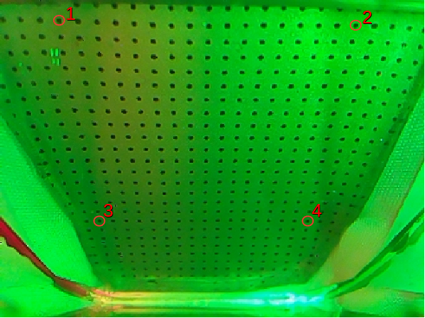

# Incipient_slip_detection_with_GelSlim

This is the code for the paper "Maintaining Grasps within Slipping Bound by Monitoring Incipient Slip" in 2019 ICRA. 

Paper link: https://arxiv.org/pdf/1810.13381.pdf

## System Requirements
We use python 2.7 and ROS Kinetic on Ubuntu 16.04

software: OpenCV >= 3.0, matplotlib

## Sensor calibration
1. capture a GelSlim image with no contact (I used 427*320 resolution). Save it with the name of "reference_image.png" or other names. Change the name in line 32 in the "sensor_calibration.py" file.

2. run sensor_calibration.py and it will let you click four points in the image. The four points should be the four corners of a square shape (in physical world). I usualy select 4 black markers since I know the gaps bwteen markers are all the same. A sample image is shown here (the selecting sequence is important):

  

3. Change the cropping boundary in line 41 if necessary. The calibrated image should look like this:

  

## Instruction for incipient slip detection
"main_slip_detection_gs1_427_320.py" and "main_slip_detection_gs2_427_320.py" are the main function for incipient slip detection. They are for the 2 sesnors, which has slight diffetent outputs. 

1. change the rostopic name in line 60 to your own image subscriber rostopic name 
2. change the M matrix in line 29 to your onw warping matrix, which is generated in the calibration process
3. change the cropping range in line 83 according to your own image 
4. change the image size in line 35
5. change the threshold for canny edge detection between line 38-41. I used different thresholds for upper and lower part of the image.
6. change the threshold for slip detection in line 52 & 53. 
